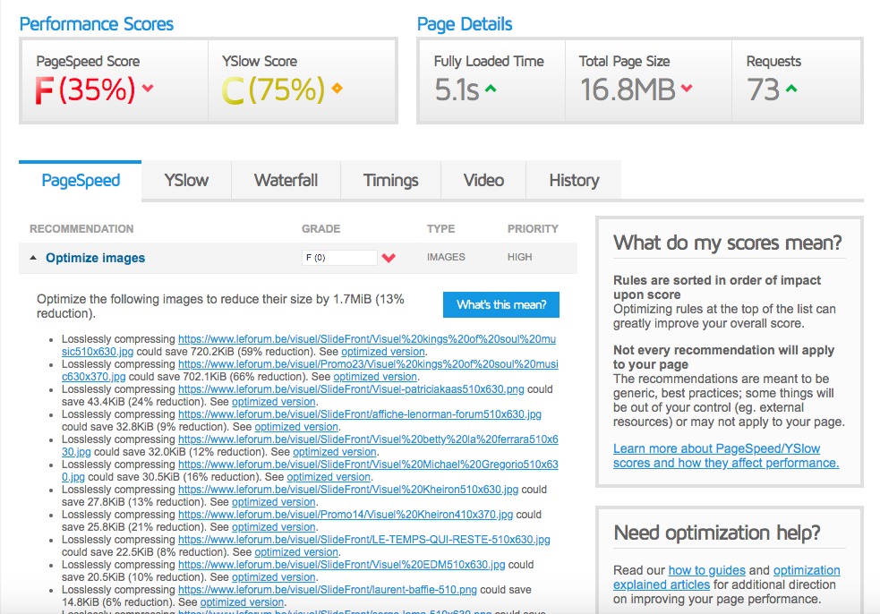
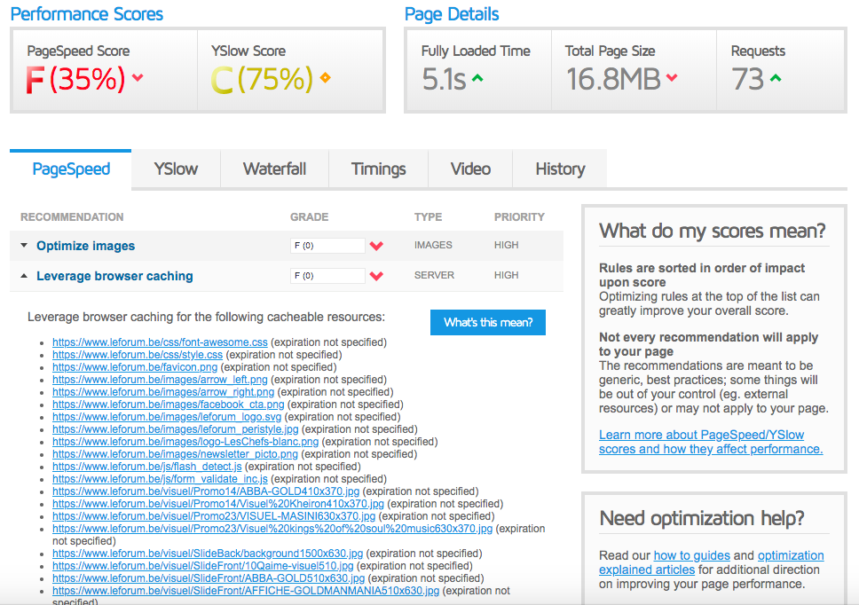
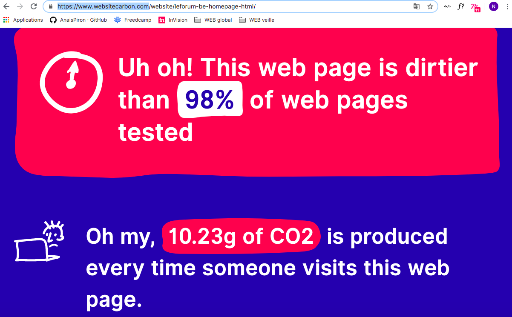

# Analyse GTmetrix 
> [Retourner à la racine du repo Le Forum](../../..) \
> Liens : [GTmetrix](https://gtmetrix.com/reports/www.leforum.be/0YdV1MpZ) & [Website Carbon Calculator](https://www.websitecarbon.com/website/leforum-be-homepage-html/)

## Analyse GTmetrix 

Le temps de chargement du site est plutôt médiocre, d’après GTmetrix, la vitesse de chargement d’une page est de **35%**, pour une moyenne de 73% en général.

Les deux gros problèmes causant la vitesse peu élevée du chargement des pages sont d’abord :  les images qui ne sont pas optimisées. Elles pourraient être **réduites de 13%** en moyenne, certaines beaucoup plus. 

Ensuite : le temps de chargement des pages peut être amélioré, notamment en stockant les données du site dans le cache. Le contenu statique de type CSS global et logos pourraient être stockés dans le cache pour une durée de 1 an et les reste pourraient être stocké pendant 1 semaine. 

Optimiser les images réduirait aussi le poids total de la page qui est beaucoup trop élevé. Il est actuellement de **16.8MB** pour une moyenne de 3.23MB en général. 

## Calcul du Carbone émis 

Nous avons calculé la quantité de carbone émis lorsque quelqu’un visite le site web, et nous pouvons remarquer que le site du forum n’est pas du tout écologique. 
En effet, il est plus « sale » que 98% des sites en général. Il produit **10,23g de CO2 à chaque visite.** Par an, le site émet environ le montant de carbone que 56 arbres absorberaient (en 1 an). 

Ce problème pourrait être résolu par exemple en rendant le site plus efficient, ou encore en se tournant vers un [green web host](https://www.wholegraindigital.com/blog/choose-a-green-web-host/) : ce sont des centres de stockages de données qui utilisent des énergies renouvelables afin d’impacter le moins possible la planète. Ce sont des endroits qui consomment beaucoup d’énergie car à l’intérieur, se trouvent des milliers de machines qui stockent et diffusent les données et il y a donc besoin de ventilateurs et d’air conditionnée pour maintenir les machines à une température ambiante. 