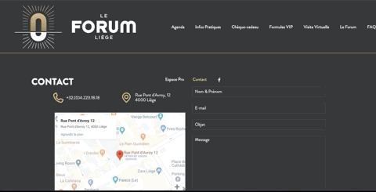

# LE FORUM - PAGE CONTACT
> La refonte de cette page été faite par AKDEDE Maïde
* * *

## Pourquoi cette page ?
Nous avons choisi cette page car c'est une page nécessaire pour les utilisateurs et cette page comporte un formulaire.

## Quelles sont les erreurs de cette page ?
Le *HTML* est mauvais de A a Z:
- Aucunes balises d'en-tête (`h1`, `h2`, etc)
- Aucun `
`
- Tout est stocké dans des `div` qui sont dans des `div` et encore dans des `div`
- La page n'a pas de `footer`
- les `input` n'ont de `label` (même caché il n'y en a pas)
- le `placeholder`des input disparait (car il s'agit de `value`) donc si on supprime ce qu'on a écrit ça ne réapparait pas et on ne sait plus de quoi il s'agit

Le *Design* :
- Le menu déborde sur le contenu du dessous
- sur pc ce n'est pas responsive car le width fait 5 mille km donc il y a des boutons du menu qu'on arrive pas a voir
- en cas d'erreur le formulaire nous affiche une `alerte` qui n'est pas claire du tout (même si on ne remplit pas l`email` il nous dira que c'est le `nom`qui est vide car c'est le premier `input`.

> Voici un aperçu du site

> Voici un aperçu de la refonte

