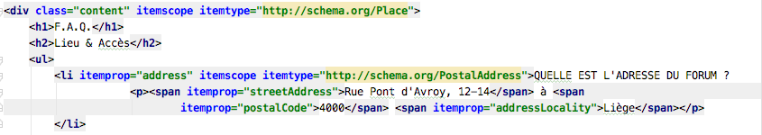
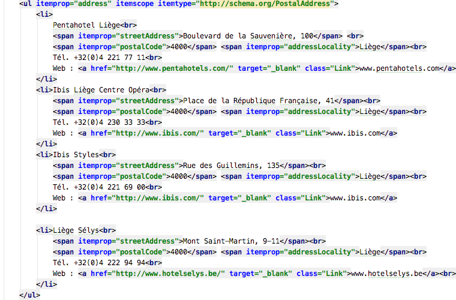

# FAQ

## Solutions

- Utilisation de <code>section</code> et de titres <code>h2</code>

- Intégration de micro-data

- <code>h2</code> = Catégories (via le tri des cartes)

- Présence d'un <code>header</code> et d'un <code>footer</code>

- Attribut alt sur les images

- Balisage correct avec des listes <code>ul</code> et <code>li</code>

- CSS minime, suppression de lignes répétitives

- Liens conforme aux directives d'AnySurfer

 
